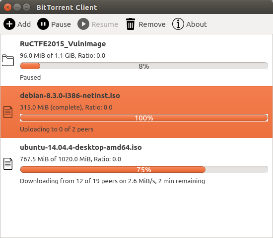

bit-torrent
===========

Simple BitTorrent client built with Python's asyncio

*A project I made for Python course.*

Features
--------

* Downloading torrents and sharing received data
* Graphical interface (supports Drag'n'Drop and can be assigned to *.torrent files in system "Open with..." dialog)
* Console interface
* Pausing torrents, watching progress, download and upload speed, ETA
* Selecting which files in a torrent you want to download
* Saving state between program restarts

Implemented specifications:

* The BitTorrent Protocol Specification ([BEP 0003][] with some additions from [the community spec][])
* Multitracker Metadata Extension ([BEP 0012][])
* *(partially)* UDP Tracker Protocol ([BEP 0015][])
* Tracker Returns Compact Peer Lists ([BEP 0023][])

[BEP 0003]: http://www.bittorrent.org/beps/bep_0003.html
[the community spec]: https://wiki.theory.org/BitTorrentSpecification
[BEP 0012]: http://www.bittorrent.org/beps/bep_0012.html
[BEP 0015]: http://www.bittorrent.org/beps/bep_0015.html
[BEP 0023]: http://www.bittorrent.org/beps/bep_0023.html

Architecture
------------

In this project I tried to avoid threads and use only asynchronous I/O. As a result, all algorithms and
network interaction work in one thread running an asyncio event loop, but there're still a few additional threads:

* Non-blocking disk I/O [isn't supported][asyncio-fs] by asyncio. To prevent freezes for up to a second
during disk writing, blocking I/O runs in a [ThreadPoolExecutor][].
* PyQt GUI runs in a main thread and invokes an asyncio event loop in a separate [QThread][]. Another option is
to use a Qt event loop in asyncio with [quamash][], but this increases UI reaction time, and the Qt event loop
may be less efficient than asyncio's default one.

[asyncio-fs]: https://github.com/python/asyncio/wiki/ThirdParty#filesystem
[ThreadPoolExecutor]: https://docs.python.org/3/library/concurrent.futures.html#concurrent.futures.ThreadPoolExecutor
[QThread]: https://doc.qt.io/qt-5/qthread.html
[quamash]: https://github.com/harvimt/quamash

Program sources depend on Python 3.5 features: they are annotated with type hints ([PEP 0484][]) and
use coroutines with `async`/`await` syntax ([PEP 0492][]).

[PEP 0484]: https://www.python.org/dev/peps/pep-0484/
[PEP 0492]: https://www.python.org/dev/peps/pep-0492/

Installation
------------

The program can be run on Linux and Windows and requires:

* Python 3.5+
* `aiohttp`, `bencodepy`, and `bitarray` modules
* PyQt5 (only for GUI)

On Ubuntu 16.04 or newer, the requirements can be installed with the following commands:

    # apt-get install python3-pip python3-pyqt5
    # python3.5 -m pip install aiohttp bitarray bencodepy

Older Linux distributions don't contain pre-installed Python 3.5. Instead of installing `python3-pip` and `python3-pyqt5` packages, you may want to build Python 3.5 and the corresponding version of PyQt5 from sources.

After installing the requirements, clone this repository:

    $ git clone https://github.com/borzunov/bit-torrent.git && cd bit-torrent

Usage
-----

### Graphical interface

Run:

    $ python3.5 torrent_gui.py

If there're torrent files provided as command line arguments, corresponding adding dialogs will be opened.

You can't start multiple GUI instances, but you can use this command to add more torrents (open the adding dialogs)
to the first one.

### Console interface

1. Run a daemon in a separate terminal:

        $ python3.5 torrent_cli.py start

2. *(optional)* Look at a list of files in a torrent you want to download:

        $ python3.5 torrent_cli.py show ~/Torrents/debian-8.3.0-i386-netinst.iso.torrent

3. Specify a download directory and add the torrent to the daemon:

        $ python3.5 torrent_cli.py add ~/Torrents/debian-8.3.0-i386-netinst.iso.torrent -d ~/Downloads

    If the torrent contains more than one file, you can select which files you want to download
    using `--include` and `--exclude` options. For more information run:

        $ python3.5 torrent_cli.py add --help

4. Watch torrent status:

        $ watch python3.5 torrent_cli.py status

    Add `-v` to increase output verbosity.

    You also can add more torrents, pause, resume, and remove them. For more information run:

        $ python3.5 torrent_cli.py --help

5. To stop the daemon run:

        $ python3.5 torrent_cli.py stop

    The daemon will recover its state after restart.

You can't start multiple daemons or start a console daemon when a GUI instance is already running,
but you can use all console commands (except `stop`) to control the GUI daemon from the console.

**Note:** Both GUI and CLI daemons binds one localhost port in range 6995-6999 for interprocess communication.
Don't make this port available outside the localhost, because it can be used to execute arbitrary commands
on your machine.

### Debug mode

You can enable a verbose debug mode for GUI and CLI daemons by adding `--debug` flag after the script name.

You may also want to enable asyncio debug mode. This is done as follows:

    $ PYTHONASYNCIODEBUG=1 python3.5 -Wdefault torrent_gui.py --debug

Author
------

Copyright (c) 2016 Alexander Borzunov
